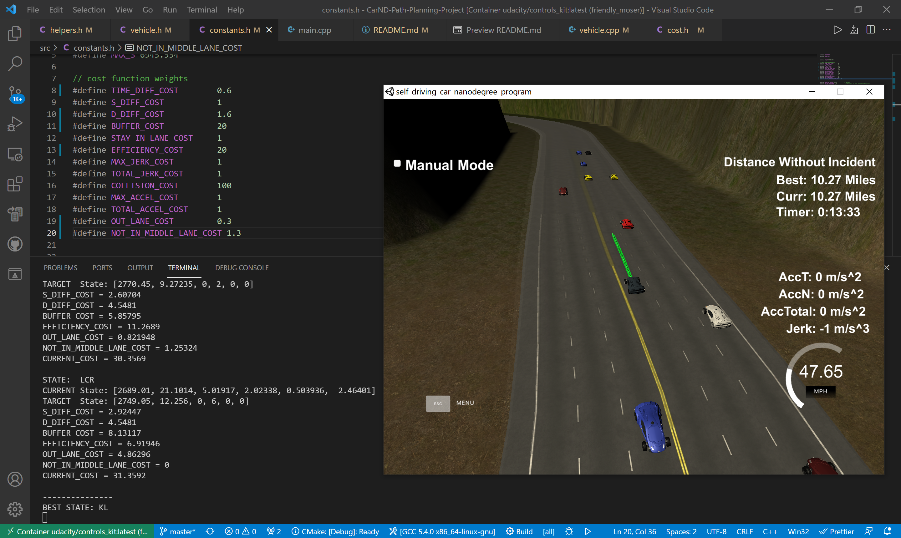
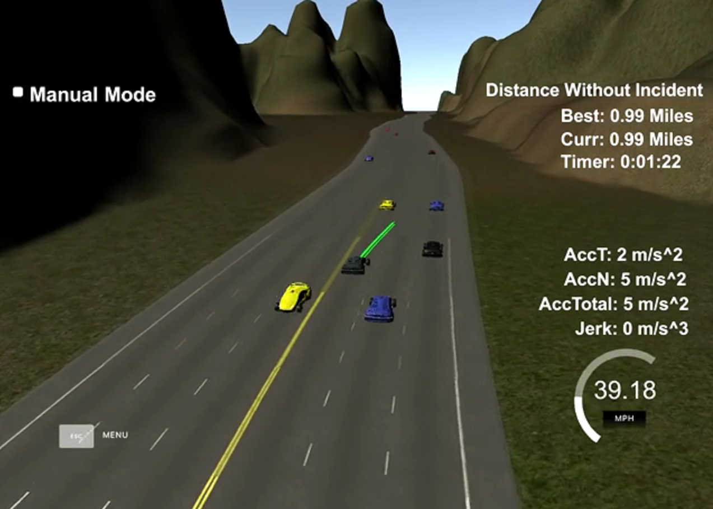

# CarND-Path-Planning-Project
Self-Driving Car Engineer Nanodegree Program
   
## Overview

The requirements of this project is listed in the [rubic page](https://review.udacity.com/#!/rubrics/1971/view). In this project, I follow the approach described in [Polynomial Trajectory Generation Playground](https://classroom.udacity.com/nanodegrees/nd013/parts/b9040951-b43f-4dd3-8b16-76e7b52f4d9d/modules/85ece059-1351-4599-bb2c-0095d6534c8c/lessons/45ae7b25-65be-4dd7-9c20-d96ca1896c2b/concepts/16ed4c00-76c6-49f2-9d53-20ecd26644e0)

The following picture shows the performance of my implementation 

## Introduction

The implementation for this project is mainly 5 steps:

1. Construct the waypoints for the ego car of the nearby road
2. Determine the ego car parameters
3. Get the sensor fusion data and calculate the parameters of other cars
4. Using the FSM to determine the ego car's next state and the best trajectory
5. Generate the new path

## Implementation

### 1. Construct the waypoints for the ego car of the nearby road

  The code is in [main.cpp line 140~191](./src/main.cpp#L140). The track waypoints in the `highway_map.csv` was 30 meters apart. It is two far way to directly use for the path generation. So this step is to use this waypoints to produce a series tightly of points(0.5 meters apart) by using spline interpolation. 

### 2. Determine the ego car's parameters

  The ego car and path's information is obtained from the simulator. The code is in [main.cpp line 193~269](./src/main.cpp#L193). Based on the previous path information, we can calculate the ego car's next motion state [s, s_dot, s_ddot, d, d_dot_dot]. If cold start, we then set the velocity and acceleration to 0.

### 3. Get the sensor fusion data and calculate the parameters of other cars

  The code is in [main.cpp line 273~336]. Here I implement a very simple finite state machine with 3 state: keep in lane, ready to change to left lane, ready to chenge to right lane. The state transition code is in function `Vehicle::update_available_states`. This step uses the sensor data to determine the other cars' information and then make a dummy prediction (keep speed and in the same line) to generate their trajectories.

### 4. Using the FSM to determine the ego car's next state and the best trajectory

  This code in [main.cpp line 337~371](./src/main.cpp#L337). This part has to meet the rubric points such as: avoid collision, jerk minimizing(JMT), keep high efficiency, keep in buffer with safety distance and so on. I use the following cost functions to get the optimal trajectory. The code is in [cost.h](/src/cost.h). All the parameters are defined in [constants.h](/src/constants.h)
  
  * time_diff_cost
  * s_diff_cost
  * d_diff_cost
  * collision_cost
  * buffer_cost
  * out_of_lane_cost
  * efficiency_cost
  * total_accel_cost
  * max_accel_cost
  * max_jerk_cost
  * total_jerk_cost
  * not_in_middle_lane_cost

### 5. Generate the new path

  The code is in [main.cpp line 375~3477](./src/main.cpp#L375). Here we get the last two previous path points and there new points(each 30 meters apart) predicted by the optimal trajectory. Then use `spline.h` to product a smooth [x,y] waypoints trajectory. 

## Conclusion

  My implementation meets all the standard rubric points. 

  * The car is able to drive at least 4.32 miles without incident
  * The car drives according to the speed limit
  * Max Acceleration and Jerk are not Exceeded
  * Car does not have collisions
  * The car stays in its lane, except for the time between changing   * lanes
  * The car is able to change lanes

The following image is the ego car changing to middle lane from left lane.

